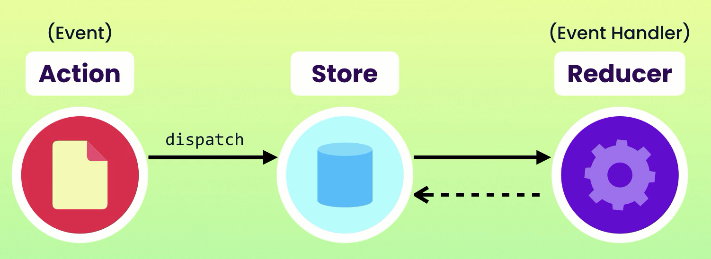
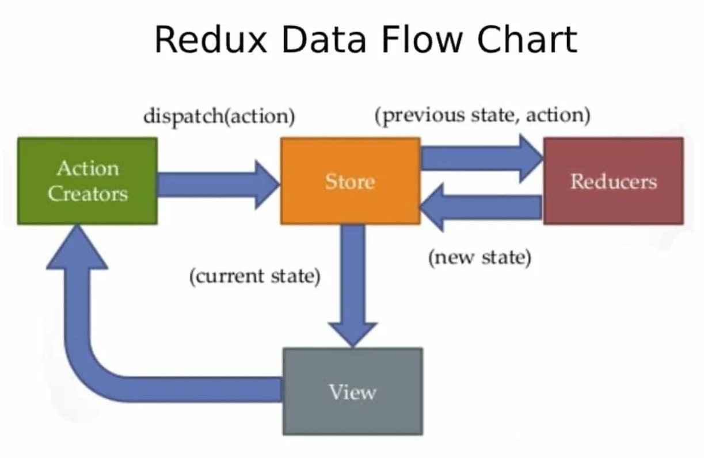
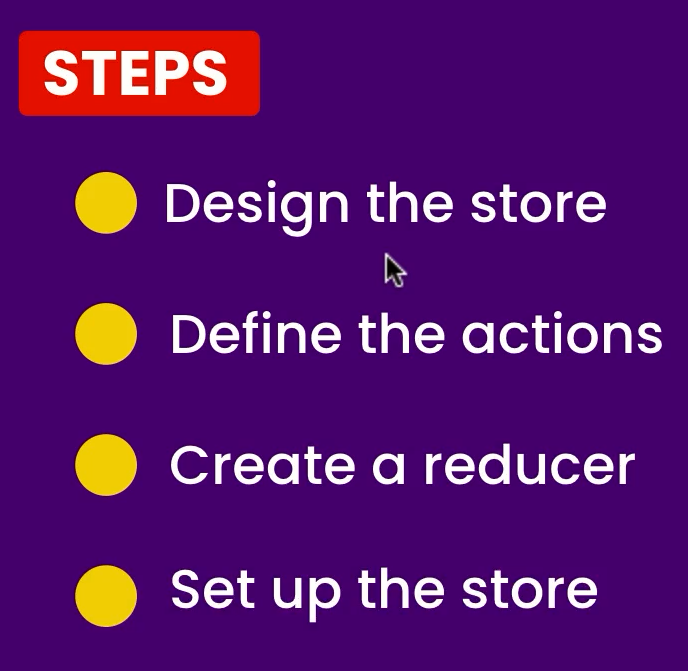

# Redux

- [Redux Atchitecture](https://github.com/sakibcy/redux-notes#redux-architecture)
- [Pros](https://github.com/sakibcy/redux-notes#pros)
- [Cons](https://github.com/sakibcy/redux-notes#cons)
- [When not to use REDUX](https://github.com/sakibcy/redux-notes#when-not-to-use-redux)
- [Flux vs Redux](https://github.com/sakibcy/redux-notes#flux-vs-redux)
- [16 useful TypeScript and JavaScript shorthands to know](https://blog.logrocket.com/16-useful-typescript-javascript-shorthands-know/)
- [Functional Programming](https://github.com/sakibcy/redux-notes#functional-programming)

<br /><br />

# Redux Architecture





<br /><br />

## Pros

- Predictable state changes
- Centralized state
- Easy debugging
- Preserve page state
- Undo/redo
- Ecosystem of add-ons

## Cons

- Complexity
- Verbosity

## When not to use REDUX

- Tight budget
- Small to medium-size apps
- Simple UI/data flow
- Static data
- [You Might Not Need Redux by Dan Abramov]()

## Flux vs Redux


<br /><br />

# Functional programming

## curring

```javascript
// javascript

function add(a) {
  return function (b) {
    return a + b;
  };
}

const add2 = (a) => (b) => a + b;

add(1)(3);
add2(1)(4);
```

## Pure function

- [Pure vs Impure Functions](https://suprabhasupi.hashnode.dev/pure-vs-impure-functions)

A ‘Pure function’ is a function whose inputs are declared as inputs and none of them should be hidden. The outputs are also declared as outputs.

Pure functions act on their parameters. It is not efficient if not returning anything. Moreover, it offers the same output for the given parameters

- No random values
- No current date/time
- No global state (DOM, files, db, etc)
- No mutation of parameters

```javascript
function func(a, b) {
  return a + b;
}
```

## Pure Function

- It always returns the same result if the same arguments are passed
- It never depends on any state/data/change during the execution of a program
- It always returns something
- Here, writing test cases will be straightforward

#### Benefits

- Self-documenting
- Easily testable
- Concurrency
- Cacheable

## Impure Function

- Changing the internal state of any argument which has been passed
- It may take effect without returning anything
- Writing test cases will be a bit complicated as there may be side effects

## Pure and Impure Methods

### These are pure methods:

- Array.map()
- Array.reduce()
- Array.filter()
- Array.concat()
- ... (spread syntax, which is mostly used to create copies)

### These are impure methods:

- Array.splice()
- Array.sort()
- Date.now()
- Math.random()

<br />
<br />
<br />

# Immutable Data

Immutable Data means that you should easily able to create data structures instead of modifying ones which is already exist.

```javascript
const person = {
    name: "Sakib",
    address: {
        country: "Bangladesh",
        city: "Dhaka"
    }
};

const updated = {
    ...person,
    address: {
        ...person.address,
        city: "Khulna"
    },
    name = "Hasan"
};

console.log(person);
```

#### Note: we have libraries for doing immutability

- immer
- immutable
- mori

here when we are modifying object, we are not directly changing it. We first copy and create new object then modify the new object

### Pros

- Predictability
- Faster Change Detection
- Concurrency

### Cons

- Performance
- Memory overhead

<br /><br />

# Steps



# Actions

To change something in the state, you need to dispatch an action. An action is a plain JavaScript object (notice how we don’t introduce any magic?) that describes what happened. Here are a few example actions:

```javascript
{ type: 'ADD_TODO', text: 'Go to swimming pool' }
{ type: 'TOGGLE_TODO', index: 1 }
{ type: 'SET_VISIBILITY_FILTER', filter: 'SHOW_ALL' }
```

#### Note: if you don't have any property called type then redux will complain
